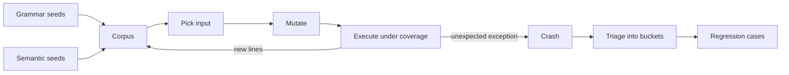

# Architecture

A campaign is a deterministic, coverage-guided loop over one target parser.

## Pieces

| Module | Responsibility |
|---|---|
| `targets.py` | The parsers under test, each with a `ParseError` contract and documented bug gaps |
| `coverage.py` | Runs a target under `sys.settrace`, records target-module lines, classifies the outcome |
| `mutators.py` | Seven mutation operators driven by a seeded PRNG |
| `corpus.py` | Grammar seeds plus a semantic edge-case generator (the pluggable LLM-corpus stand-in) |
| `engine.py` | The coverage-guided campaign loop with a retained-corpus power schedule |
| `triage.py` | Deduplicates crashes into buckets by `(exception, location)` with a severity heuristic |
| `regression.py` | Promotes buckets to regression cases and replays them |

## What counts as a crash

The targets are Python, so there is no memory corruption to find. Instead each
parser has a contract: reject malformed input by raising `ParseError` and nothing
else. Any other exception that escapes — `ValueError`, `IndexError`,
`struct.error`, `KeyError`, `TypeError`, a `UnicodeDecodeError`, or a
`RecursionError` — is a robustness bug. This is the exact class of defect that
becomes a crash or an out-of-bounds read when the same protocol is parsed in a
memory-unsafe language, which is why finding it on a memory-safe reference
implementation is useful.

## Coverage without breaking coverage

`execute` instruments a target with `sys.settrace`. A naive implementation would
call `sys.settrace(None)` afterward and silently disable any outer tracer —
including the one `coverage.py` installs to measure this project. `execute`
instead saves `sys.gettrace()` and restores it, so the tool can measure its own
test coverage honestly while instrumenting targets.

## Determinism

The corpus order, the seeded PRNG, and line-coverage sets are all deterministic,
so a campaign from a fixed seed always discovers the same crash buckets. That is
what lets the benchmark treat "which bugs were found" as reproducible evidence
and hash it.
